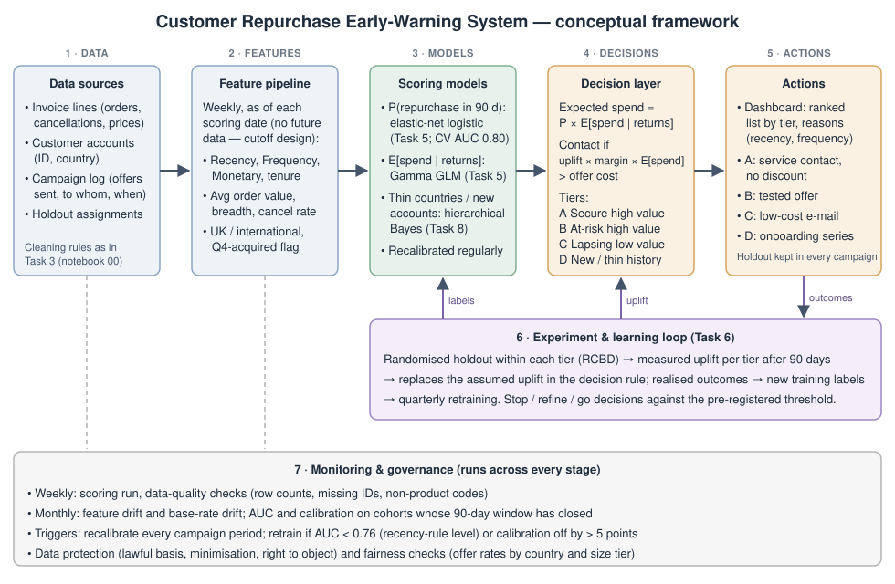

# Task 10 -- Industry Innovation Proposal: a Customer Repurchase Early-Warning System

*Owner: Member D. Every number is taken from the project's analysis notebooks, cited in brackets. Proposed thresholds,
roles and timelines are **proposals to confirm with the client**, not facts about the organisation. Costs, margins and
offer effects are **not known** and are marked as assumptions wherever they appear.*

*Figure 10.1: Conceptual framework. Stages 1–5 run every week. Stage 6 (the experiment loop) supplies the one number
the models cannot: the offer's real effect. Stage 7 governs all stages.*

## 10.1 Business need

* **Most of the customer base is inactive at any moment.** Only 43.4% of customers bought again in the 90 days after the
  cutoff. 30% have placed a single order, and the median customer last ordered 162 days before the cutoff (notebook 01).
* **Revenue depends on a few accounts.** The top 1% of customers bring in 30.8% of revenue and the top 10% bring in 62.7%
  (notebook 01). Losing a handful of large wholesale buyers would hurt materially, and a lapse is currently noticed only
  after the fact.
* **The signal exists before the lapse.** Past behaviour alone ranks customers well: repeated cross-validation AUC 0.799
  (SD 0.015), with the top 10% of scores repurchasing at about twice the base rate (lift 2.09), well above the "most recent
  customers first" rule (AUC 0.762) (notebook 03, A9). Nobody at the retailer uses that signal today.
* **Spending on retention is currently unguided.** There is no evidence yet on whether offers work, or for whom (Task 6).

**Business objective.** Identify, every week, which customers are drifting away and which of them are worth acting on,
so that retention effort goes where it produces *measured* incremental margin. The target is to raise the 90-day
repurchase rate among contacted at-risk, high-value accounts above that of a randomised holdout, by at least the
pre-registered threshold from the Task 6 pilot.

## 10.2 Proposed solution

A weekly scoring and decision pipeline with a built-in experiment loop (Figure 10.1).

| Component | Design | Grounded in |
|---|---|---|
| **Data inputs** | Invoice lines (orders, cancellations, prices, dates), customer accounts (ID, country), and a new campaign log recording who was sent which offer and when, plus holdout assignments | Task 3 data; the campaign log is new and needed for Stage 6 |
| **Feature pipeline** | Weekly job that recomputes, as of the scoring date only, recency, frequency, monetary value, tenure, average order value, product breadth, cancellation rate, UK/international and Q4-acquired flag. Uses the same cleaning rules as notebook 00 (duplicates, non-product codes, non-positive prices, reversed orders) | The cutoff design (`src/features.py`) guarantees no future data leaks into a score |
| **Model outputs** | Per customer: P(repurchase in the next 90 days) from the elastic-net logistic model; E[spend if they return] from the Gamma GLM; expected spend = the product. Countries or accounts with very little history get a pooled estimate from the hierarchical Bayesian model | Tasks 5 and 8 |
| **Decision thresholds** | Contact if uplift × margin × expected spend > offer cost. With placeholder values (10% uplift, 30% margin, £10 offer) that means expected spend > £333, which would select about 44% of customers (notebook 03, C3). **The uplift must come from the pilot**, not from assumption | Task 5, C3; Task 6 |
| **Dashboard tiers** | **A. Secure, high value:** high P and high expected spend. **B. At risk, high value:** high expected spend but P falling as recency grows. **C. Lapsing, low value:** low P and low expected spend. **D. New / thin history:** tenure under 90 days or an unseen country, scored with pooled estimates | Tier cut-offs set from score quantiles and reviewed after the pilot |
| **Campaign actions** | **A:** account-manager service contact, *no discount*. The top tier repurchases at about 81% anyway (notebook 07), so a discount mostly rewards purchases that would have happened. **B:** the offer tested in the pilot, if it passed. **C:** low-cost automated e-mail only. **D:** onboarding sequence | Ascarza (2018); Devriendt et al. (2021) |
| **A/B feedback loop** | Every campaign keeps a randomised holdout within each tier (the RCBD from Task 6). After 90 days, the measured uplift per tier **replaces** the assumed uplift in the decision rule, and realised outcomes become new training labels | Kohavi et al. (2009); Lemmens & Gupta (2020) |

The dashboard shows each account's tier, its score, and the plain-language reasons behind it (e.g. "no order for 140
days; ordered monthly before"). Account managers get a reason, not just a number.

## 10.3 Expected benefits

* **Earlier action on the accounts that matter.** A lapsing top-decile account is flagged weeks before anyone would
  currently notice.
* **Retention budget guided by evidence, not by guesswork.** The experiment loop turns the assumed uplift, currently the
  largest uncertainty in the profit estimate (contact share 4%–82% depending on it, notebook 03 C3), into a measured one.
* **Less money wasted on customers who would buy anyway.** Secure accounts get service, not discounts.
* **One consistent definition of an "active customer"** across sales, marketing and finance.

No £ benefit is claimed. The analysis cannot estimate one until the pilot measures the offer's effect (Task 6). Any
figure quoted before then would be an assumption presented as a result.

## 10.4 Implementation plan

| Phase | Duration (proposed) | What happens | Exit criterion |
|---|---|---|---|
| **0. Data foundation** | 4 weeks | Automate the weekly extract; port the notebook 00 cleaning rules into a scheduled job; create the campaign log | Weekly customer table matches a manual rebuild |
| **1. Shadow scoring** | 6 weeks | Score weekly and publish the dashboard, **no campaigns**. Check that scores are stable and that tiers make sense to account managers | Account managers agree the tiers are usable; AUC on the first matured cohort ≥ 0.76 |
| **2. Pilot** | about 4 months (2 weeks set-up + 90-day window + read-out) | Task 6 RCBD pilot, launched outside October–December | Pre-registered stop / refine / go decision |
| **3. Rollout with holdout** | ongoing | Tiered campaigns, a permanent randomised holdout (e.g. 10–20% of each tier), quarterly retraining | Quarterly KPI review |

**Required systems:** a scheduled data extract from the order system; a scripting environment for the pipeline (the
project's Python code is the prototype); a dashboard tool; the existing e-mail platform, able to send unique single-use codes.

**Required staff (proposed):** a *responsible owner* on the business side (e.g. the head of sales or customer retention;
to be confirmed with the client) who decides campaigns and owns the KPIs; a data analyst (part-time) who runs and monitors
the pipeline; a marketing executive who runs the campaigns; account managers who act on tiers A and B; and the data
protection lead for sign-off.

## 10.5 KPIs and monitoring

| Level | KPI | Proposed target / trigger | Why this number |
|---|---|---|---|
| Model | AUC on cohorts whose 90-day window has closed | Retrain if it falls below **0.76** | 0.76 is what the simple recency rule achieves (notebook 03, A9); below it, the model adds nothing |
| Model | Calibration: mean predicted vs actual repurchase rate | Recalibrate **every campaign period**; alert if off by more than **5 points** | Out-of-time tests showed the probability level shifts by 12–15 points between seasons while the ranking holds (notebook 03, A8); miscalibrated probabilities mislead decisions (Van Calster et al., 2019) |
| Data | Feature drift and base-rate drift | Monthly check against the training period | Base rates ranged from 32% to 58% across the cutoffs tested (notebook 03, A8) |
| Data | Data-quality checks | Weekly: row counts, share of missing customer IDs (22.8% in the raw data), non-product codes | Task 3 cleaning audit |
| Business | Incremental repurchase rate, treated vs holdout, per tier | At least the pilot's pre-registered threshold | The only KPI that measures the *effect* of the system |
| Business | Incremental margin per £ of offer cost | > 1 | Break-even |
| Business | Unsubscribes and complaints per campaign | Agreed with marketing before launch | Guards against over-contacting |

**Monitoring cadence:** scoring and data-quality checks weekly; drift and performance monthly; retraining and KPI review
quarterly. Outcomes only become known 90 days after each score, so model performance is always measured on cohorts at
least one quarter old. The system has a built-in lag, and that lag has to be planned for. Churn models have been shown to hold
most of their accuracy when applied three months later (Neslin et al., 2006), which supports quarterly rather than
monthly retraining; the out-of-time results here agree for ranking (AUC 0.80 vs 0.81) but not for calibration.

**Model-drift controls:** out-of-time validation before any retrained model replaces the current one; the recency rule
kept as a permanently running benchmark; a rollback to the previous model version if the new one underperforms on the
latest matured cohort.

## 10.6 Implementation challenges

* **Outcome lag.** It takes 90 days to learn whether a score was right, so problems surface slowly.
* **Seasonality.** Probability levels shift between seasons (notebook 03, A8), so recalibration is a standing task, not a
  one-off.
* **Missing identities.** 22.8% of raw invoice lines have no customer ID, and they are not missing at random (Task 3). The
  system can only see and act on identifiable accounts. Encouraging account log-in at checkout widens its coverage.
* **Thin international data.** 26 of 41 countries have fewer than 10 customers (notebook 05). Their estimates rely on
  pooling and should be shown with that caveat.
* **Organisational adoption.** Account managers must trust the tiers. Phase 1 (shadow scoring) exists to build that
  trust before any money is spent.

## 10.7 Data protection and fairness safeguards

* **Minimisation:** the pipeline uses only order behaviour and country. It needs no personal characteristics.
* **Lawful basis and objection:** the data protection lead confirms the lawful basis for profiling customers for
  marketing, and honours objections to direct-marketing profiling, particularly for accounts held by individuals such as
  sole traders.
* **Fairness monitoring:** offer rates are reported by country and customer-size tier each quarter. Whoever owns the
  system reviews them, so that systematically fewer offers to small or international customers is a deliberate policy,
  not an unexamined side-effect. Country enters the model only as UK vs international, plus pooled estimates for thin
  groups.
* **Transparency:** customers who receive the same offer get the same terms, and the reasons shown on the dashboard are
  behavioural and explainable.
* **Retention of experiment data:** holdout assignments are kept only as long as needed to analyse the experiment.

## 10.8 Organisational impact

The system changes retention from a reactive activity (noticing that a big customer has stopped ordering) into a weekly,
measured routine. It gives sales, marketing and finance one shared view of customer health. It also builds the
organisation's ability to test before spending, which transfers to pricing, product and channel decisions beyond
retention. The time-series evidence (Task 9) supports running this system rather than a revenue-forecasting tool first.
Two years of history is not enough for a reliable seasonal forecast (the fitted model lost to a naive forecast), while
customer-level scoring works now.

## References (Task 10)

Ascarza, E. (2018). Retention futility: Targeting high-risk customers might be ineffective. *Journal of Marketing Research, 55*(1), 80--98. https://doi.org/10.1509/jmr.16.0163

Devriendt, F., Berrevoets, J., & Verbeke, W. (2021). Why you should stop predicting customer churn and start using uplift models. *Information Sciences, 548*, 497--515. https://doi.org/10.1016/j.ins.2019.12.075

Kohavi, R., Longbotham, R., Sommerfield, D., & Henne, R. M. (2009). Controlled experiments on the web: Survey and practical guide. *Data Mining and Knowledge Discovery, 18*(1), 140--181. https://doi.org/10.1007/s10618-008-0114-1

Lemmens, A., & Gupta, S. (2020). Managing churn to maximize profits. *Marketing Science, 39*(5), 956--973. https://doi.org/10.1287/mksc.2020.1229

Neslin, S. A., Gupta, S., Kamakura, W., Lu, J., & Mason, C. H. (2006). Defection detection: Measuring and understanding the predictive accuracy of customer churn models. *Journal of Marketing Research, 43*(2), 204--211. https://doi.org/10.1509/jmkr.43.2.204

Van Calster, B., McLernon, D. J., van Smeden, M., Wynants, L., & Steyerberg, E. W. (2019). Calibration: The Achilles heel of predictive analytics. *BMC Medicine, 17*, 230. https://doi.org/10.1186/s12916-019-1466-7
