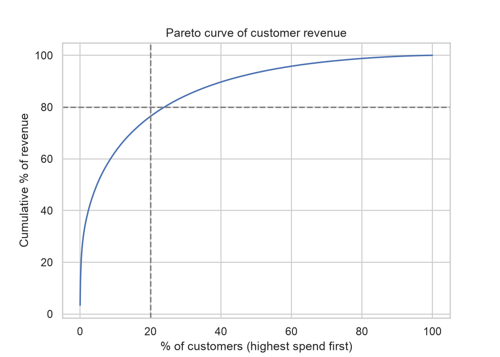
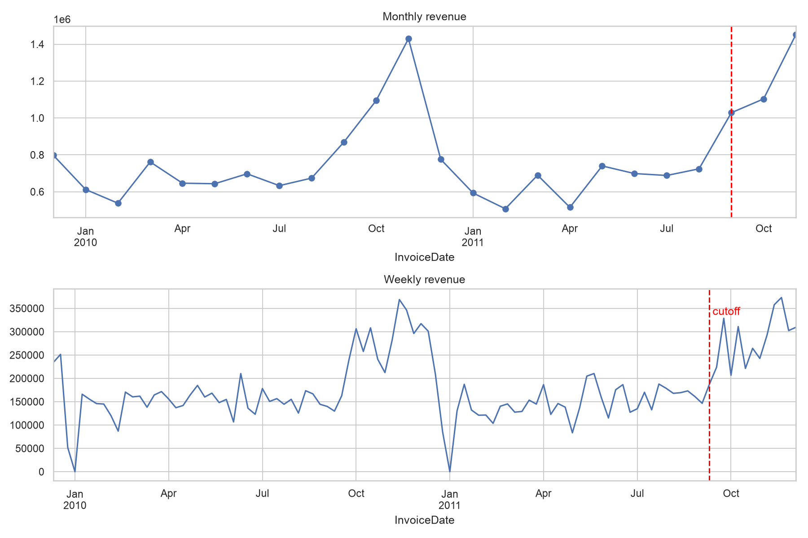

# Task 3 -- Dataset Understanding and Descriptive Analysis

*Owner: Member A. Numbers come from `notebooks/python/00_data_cleaning.ipynb` (cleaning and data-quality summary) and
`01_descriptive_analysis.ipynb` (missing values, descriptive statistics, business insights).*

## 3.1 Dataset description

| Item | Value |
|---|---|
| Source | UCI Machine Learning Repository, *Online Retail II* (Chen, 2012), publicly available |
| Business | A UK-based online retailer of all-occasion giftware; many of its customers are wholesalers |
| Period | 1 December 2009 to 9 December 2011 (two Excel sheets, one per year) |
| Raw size | **1,067,371 invoice lines × 8 columns** |
| Unit of observation | One product line on one invoice: not one customer, and not one order |

**Raw variables**

| Variable | Type | Meaning |
|---|---|---|
| `Invoice` | Categorical (ID) | Invoice number; a leading "C" marks a cancellation |
| `StockCode` | Categorical (ID) | Product code |
| `Description` | Text | Product name |
| `Quantity` | Numeric, discrete | Units on the line; negative for returns and cancellations |
| `InvoiceDate` | Date-time | When the transaction happened |
| `Price` | Numeric, continuous | Unit price (£) |
| `Customer ID` | Categorical (ID) | Customer account; often missing |
| `Country` | Categorical, nominal | Customer's country (about 40 values) |

The raw file has only two genuinely numeric variables, so it is not suitable for modelling as it stands. The analysis
dataset is a **customer-level table** built from it.

**Customer-level analysis table: 5,253 customers × 12 columns.** Every feature is computed only from transactions
**before 9 September 2011** (the cutoff). Both targets are computed only from the **90 days after** it. This split
prevents information from the future leaking into the predictors.

| Variable | Definition |
|---|---|
| `Recency` | Days from the customer's last purchase to the cutoff |
| `Frequency` | Number of distinct (non-cancelled) invoices before the cutoff |
| `Monetary` | Total spend (£) before the cutoff |
| `TenureDays` | Days from first purchase to the cutoff |
| `AvgBasketValue` | `Monetary / Frequency`: the customer's average order value (£) |
| `DistinctProducts` | Number of different products bought |
| `CancellationRate` | Cancelled invoices ÷ all invoices |
| `IsUK` | 1 if the customer's most frequent country is the UK |
| `AcquiredInQ4` | 1 if the first purchase was in October–December |
| **`Repurchase`** (target) | 1 if the customer bought anything in the 90 days after the cutoff |
| **`FutureSpend`** (target) | Spend (£) in those 90 days; 0 for non-repurchasers |

## 3.2 Data-quality assessment

The cleaning steps, applied in this order, and the rows each removed (notebook 00, data-quality summary):

| Step | Rows removed | Rows remaining | Reason |
|---|---|---|---|
| Raw invoice lines | | 1,067,371 | |
| Non-product codes, base list (postage, bank charges, fees, manual entries) | 5,617 | 1,061,754 | Not product sales; postage would inflate overseas customers' spend |
| Price ≤ 0 | 6,182 | 1,055,572 | Free items, warehouse stock notes ("short", "mixed"), bad-debt write-offs such as −£53,594. This step also removes all 3,457 negative-quantity lines that are not cancellations, since every one has price £0 |
| Exact duplicate rows | 34,038 | 1,021,534 | The same line entered twice would double-count revenue (one invoice was overstated by 13%) |
| Extended non-product list (samples, adjustments, gift vouchers, test items, charity commission) | 277 | 1,021,257 | Found during descriptive analysis; every removed row was listed and checked before deletion |
| Mistaken orders reversed within minutes (invoices 581483/C581484, 541431/C541433, 556444) | 5 | **1,021,252** | Data-entry errors, e.g. 80,995 units (£168k) cancelled 12 minutes later. Both halves are removed: keeping only the sale would invent a £168k customer, while keeping both would invent a 50% cancellation rate |

**Kept, but flagged or handled:**

* **Cancellations:** 17,912 clean lines (1.75%) are kept, flagged `IsCancellation`, and used to compute each customer's
  `CancellationRate`. Cancellation behaviour is itself a retention signal.
* **Very large genuine orders** (e.g. 19,152 mugs at £0.10 for a Danish wholesaler) are kept. They have no matching
  cancellation, a plausible bulk price, and a repeat-buying history: they are real wholesale behaviour. They are handled
  with log transforms and influence checks rather than deleted. **The rule applied was to delete errors, not extremes.**

## 3.3 Missing-value analysis

| | Lines | Share |
|---|---|---|
| Raw lines with no `Customer ID` | 243,007 | 22.77% |
| Clean lines with no `Customer ID` | 227,089 | 22.24% |
| Net revenue on clean lines with no ID | £2,568,806 | **13.6%** of net revenue |

`Customer ID` is the only variable with missing values. The missingness was **tested rather than assumed random**:

* Rows without an ID differ systematically from rows with one: smaller quantities, higher unit prices, more non-UK
  countries (Hong Kong and Bermuda are 100% missing), and different times of day. Every univariate test is significant
  after Holm correction.
* A logistic model predicts whether a line is missing its ID with **AUC 0.80**, so the IDs are **not missing completely at
  random** (Rubin, 1976; Little, 1988). The most plausible explanation is a separate order channel that is not linked to
  customer accounts.

**Treatment.** An identifier cannot be imputed: a "median customer" is meaningless, and guessing would invent purchase
histories. Missing-ID lines are therefore **kept for revenue totals, trends and country analysis**, and **excluded from
the customer-level table**, because a prediction has to belong to a customer. **Consequence: every customer-level
conclusion in Tasks 4, 5 and 8 applies to identifiable, account-holding customers only.** These customers under-represent
the smaller, higher-priced, non-UK orders that make up the missing-ID lines. The customer table itself has no missing
values.

## 3.4 Outlier detection

* **Line level:** 99% of lines are below £179, but the largest is £15,818 (9,360 units). The raw maximum quantity of 80,995
  was an error and was removed (3.2).
* **Customer level:** customer spend has a skewness of 24.3. The mean (£2,580) is 3.3 times the median (£776), the 99th
  percentile is £24,400, and the maximum is £456,780. On the log scale the distribution is roughly symmetric, which is why
  Tasks 4 and 5 work with logs.
* **Influence in models:** a single repurchaser (2 orders and £97 of history, then £53k of spend) has a Cook's distance of
  8.7 in the Gamma spend model (Task 5). The models report influence diagnostics rather than deleting such customers.

## 3.5 Descriptive statistics (customer table, n = 5,253)

| Variable | Mean | Median | Min | Max |
|---|---|---|---|---|
| Recency (days) | 205.7 | 162 | 0 | 646 |
| Frequency (orders) | 5.7 | 3 | 1 | 284 |
| Monetary (£) | 2,580 | 776 | 1.55 | 456,780 |
| Distinct products | 74.5 | 41 | 1 | 2,178 |
| Tenure (days) | 429.9 | 472 | 0 | 646 |
| Average order value (£) | 362.7 | 275.0 | 1.55 | 14,845 |
| UK customers | 91.3% | | | |
| Q4-acquired | 32.9% | | | |
| **Repurchased in next 90 days** | **43.4%** | | | |

*Figure 3.1: Revenue concentration. The top 10% of customers account for 62.7% of revenue.*

*Figure 3.2: Monthly revenue. November peaks are about 2.2 times a typical off-peak month.*

## 3.6 Initial business insights

| Finding | What it means for the business |
|---|---|
| **Revenue is concentrated:** the top 1% of customers = 30.8% of revenue; top 10% = 62.7%; top 10 customers = 16.1% | Losing a handful of accounts would hurt materially. Retention effort should be weighted towards high-value customers (Task 12, S4) |
| **Most customers are inactive at any moment:** only 43.4% repurchased in the 90 days; 30.0% have ordered once; median recency is 162 days | This gap is the retention opportunity the project targets |
| **The "average customer" is misleading:** mean spend is 3.3 × the median | Track medians and segments, not averages |
| **UK-dependent, but with valuable international accounts:** the UK = 85.3% of revenue, yet 4 of the top 10 customers are international while only 8.7% of customers are | Hypothesis for Task 4: international customers place larger orders |
| **Strong seasonality:** November revenue £1.43M (2010) and £1.45M (2011), about 2.2 × the median off-peak month (£660k); the rise starts in August/September | Stock, staff and cash need building from August. The 90-day target window (Sep–Dec 2011) falls inside the peak, so the 43.4% repurchase rate probably overstates the off-peak rate |
| **B2B trading rhythm:** Saturday = 0.1% of revenue; 75% of revenue arrives between 10:00 and 16:00 | Trade customers order in business hours: time campaigns for weekday mornings |
| **Cancellations are concentrated:** mean cancellation rate 11.4%, median 0, 90th percentile 38% | A minority of customers generate most cancellations: a candidate risk signal (used as a model feature) |

## References (Task 3)

Chen, D. (2012). *Online Retail II* [Dataset]. UCI Machine Learning Repository. https://doi.org/10.24432/C5CG6D

Little, R. J. A. (1988). A test of missing completely at random for multivariate data with missing values. *Journal of the American Statistical Association, 83*(404), 1198--1202. https://doi.org/10.1080/01621459.1988.10478722

Rubin, D. B. (1976). Inference and missing data. *Biometrika, 63*(3), 581--592. https://doi.org/10.1093/biomet/63.3.581
