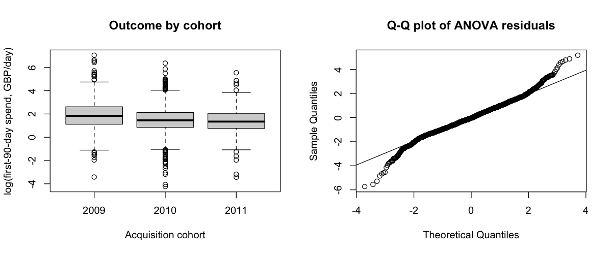

# Task 4 -- Statistical Inference

*Owner: Member B. All results come from `notebooks/r/02_statistical_inference.R`, run on the customer table (n = 5,253).
These are observational comparisons: they establish **associations**, not the effect of any intervention.*

Four pre-planned tests answer four different client questions. They are not a search through many comparisons, so no
correction is applied across the four headline tests (with Bonferroni the threshold would be 0.0125, and every headline
result would still pass). Within Test 4, Games–Howell controls the error rate across its three pairwise comparisons.
Every test reports an effect size with a confidence interval, because with 5,253 customers even trivial differences
become "significant" (Lin et al., 2013; Sullivan & Feinn, 2012).

## Summary

| Test | Question | Result | Effect size [95% CI] | Size |
|---|---|---|---|---|
| 1. Means | Do international and UK customers differ in typical order value? | Welch t(515.8) = 12.41, p < .001 | Geometric-mean ratio 1.68 [1.55, 1.82]; d = 0.72 [0.62, 0.81] | Medium–large |
| 2. Proportions | Do Q4-acquired customers repurchase more often? | χ²(1) = 43.37, p < .001 | +9.6 points [6.7, 12.5]; RR 1.24 [1.16, 1.32]; V = 0.09 [0.06, 0.12] | Small |
| 3. Variances | Is order value more variable for international customers? | Brown–Forsythe F(1, 5251) = 123.94, p < .001 | Variance ratio 5.24, bootstrap [1.94, 13.39] | Large but imprecise |
| 4. ANOVA | Does early spending rate differ by acquisition cohort? | Welch F(2, 1343.7) = 45.11, p < .001 | ω² = 0.022 [0.014, 0.030] | Small |

## Test 1 -- Comparison of means: order value, international vs UK

* **Research question.** Do international and UK customers differ in their typical average order value?
* **Hypotheses.** H0: mean log(average order value) is equal for UK and international customers. H1: the means differ
  (two-sided; no direction was assumed in advance).
* **Why this test.** Average order value is heavily right-skewed (Task 3), so it is compared on the log scale. A
  difference in mean logs back-transforms to a **ratio of geometric means**, which is easy to read in business terms.
  The groups are very unequal in size (457 vs 4,796) and Test 3 shows their variances differ, so **Welch's t-test** is used
  instead of Student's (Delacre et al., 2017).
* **Assumption checks.** On the log scale both groups are close to symmetric (skewness 0.29 international, −0.39 UK). With
  groups this large, the t-test needs only the group means to be approximately normal. A Mann–Whitney U test, which does
  not assume normality, is run as a robustness check.
* **Results.** Geometric-mean order value: international **£432**, UK **£257**. Welch t(515.8) = 12.41, p < .001.
  **Geometric-mean ratio (international / UK) = 1.68, 95% CI [1.55, 1.82].** Cohen's d = 0.72 [0.62, 0.81]. Mann–Whitney
  agrees: W = 1,495,183, p < .001.
* **Interpretation.** A typical international customer's average order is about 55–82% larger than a typical UK
  customer's. This is a medium-to-large difference, and it does not depend on the log transform.
* **Practical implication.** Pricing and account management should not assume overseas orders are smaller. The opposite
  holds, which is consistent with overseas wholesale accounts consolidating orders to save on freight.
* **Limitation.** Country is observed, not assigned, so this is an association. The international group mixes about 40
  countries of very different sizes.

## Test 2 -- Comparison of proportions: repurchase, Q4-acquired vs others

* **Research question.** Do customers first acquired in October–December repurchase in the 90 days after the cutoff at a
  different rate from other customers?
* **Hypotheses.** H0: the repurchase proportion is equal for Q4-acquired and other customers. H1: the proportions differ
  (two-sided).
* **Why this test.** Both variables are binary, so a chi-square test of independence on the 2 × 2 table (equivalent to the
  two-proportion z-test) with Yates' continuity correction is appropriate.
* **Assumption checks.** Customers are independent (one row each), and the smallest expected cell count is 749, far above
  the required 5.
* **Results.** Repurchase rate: **49.8%** for Q4-acquired customers (861 of 1,728) vs **40.2%** for others (1,417 of 3,525).
  χ²(1) = 43.37, p < .001. **Difference = 9.6 percentage points, 95% CI [6.7, 12.5].** Relative risk 1.24 [1.16, 1.32];
  odds ratio 1.48 [1.32, 1.66]; Cramér's V = 0.09 [0.06, 0.12].
* **Interpretation.** The difference is real but **small**. The tiny p-value reflects the large sample more than a strong
  effect.
* **Practical implication.** A Q4-acquired customer is about 10 points more likely to come back. That is worth using as
  one input to a targeting model (it is one of the Task 5 predictors), but it is too weak to justify a budget decision on
  its own.
* **Limitation.** The outcome window (Sep–Dec 2011) is itself the Christmas season. The association may reflect a
  seasonal buying rhythm (customers first seen in Q4 buy again in Q4) rather than anything about *when* they were
  acquired, and this design cannot separate the two.

## Test 3 -- Comparison of variances: spread of order value, international vs UK

* **Research question.** Is customer-level average order value more variable among international customers than among
  UK customers?
* **Hypotheses.** H0: the variance of average order value is equal in the two groups. H1: the variances differ (two-sided;
  the direction is read from the variance ratio).
* **Why this test.** The **Brown–Forsythe** (median-centred Levene) test is robust to non-normality (Brown & Forsythe,
  1974). The classical F-test of variances is not, and average order value is heavily skewed with very unequal groups.
* **Assumption checks.** Descriptive statistics: international n = 457, mean £664, SD £966; UK n = 4,796, mean £334,
  SD £422. Median centring protects the test against the skew and outliers in both groups.
* **Results.** Brown–Forsythe F(1, 5251) = 123.94, p < .001. **Variance ratio (international / UK) = 5.24, bootstrap 95% CI
  [1.94, 13.39]** (5,000 resamples). The bootstrap is used because a parametric interval would rest on the normality
  assumption the test was chosen to avoid.
* **Interpretation.** The interval lies entirely above 1, so international customers' order values are more variable.
  The interval is **wide**, because there are only 457 international customers and a few very large accounts dominate
  the variance. The size of the difference (anything from about 2× to 13×) is therefore uncertain, even though its
  direction is clear.
* **Practical implication.** A single "average international order" figure is unreliable for planning. International
  accounts should be segmented by order size (Task 12, O4).
* **Limitation.** The test shows a difference in spread, not its cause, and not whether any pricing or credit policy
  would change it.

## Test 4 -- ANOVA: early spending rate by acquisition cohort

**Research question.** Does customers' spending rate over their first 90 days differ across acquisition-year cohorts?

**Design history.** An earlier version compared total spend (`Monetary`) by Frequency quartile, which is partly circular
because Monetary = Frequency × average order value. Comparing *total* spend by cohort is confounded by exposure time:
the 2009 cohort had about 640 days to accumulate spend, the 2011 cohort about 138. Dividing by tenure was checked and
rejected: 2 customers have zero tenure, 102 have under 30 days, and log(Monetary / Tenure) is *negatively* correlated
with tenure (r = −0.24), so it reverses the bias rather than removing it.

**Outcome.** **SpendRate90** = spend in each customer's first 90 days after their first purchase, divided by 90 (£ per
day). Every customer is measured over the same 90-day exposure. Only customers whose full 90-day window ends before the
cutoff are eligible, which **excludes 302 customers acquired in the 90 days before the cutoff, all from the 2011 cohort**.
The outcome is analysed as log(SpendRate90).

**Hypotheses.** H0: mean log(SpendRate90) is equal across the 2009, 2010 and 2011 cohorts. H1: at least one cohort mean
differs.

**Why this test.** Cohort sizes are very unequal and the variances differ (checked below), so **Welch's one-way ANOVA**
is used instead of the classical F-test (Delacre et al., 2019). Games–Howell post-hoc comparisons allow for unequal
variances and sample sizes. Kruskal–Wallis is run as a robustness check, and ω² is reported as the effect size.

**Assumption checks.**

| Cohort | n | Mean rate (£/day) | SD | Median | Mean log | Skew (log) |
|---|---|---|---|---|---|---|
| 2009 | 951 | 16.40 | 58.58 | 6.30 | 1.870 | 0.28 |
| 2010 | 3,364 | 7.56 | 16.12 | 4.29 | 1.492 | −0.11 |
| 2011 | 636 | 7.10 | 13.91 | 3.84 | 1.412 | −0.11 |

On the log scale the outcome is close to symmetric within every cohort. 52 observations lie more than 3 SD from their
cohort mean and are kept. Brown–Forsythe: F(2, 4948) = 23.91, p < .001, so the variances differ, which supports Welch.
The residual Q-Q plot is roughly symmetric with heavier tails than normal (Figure 4.1), which is why the rank-based
check matters.

**Results.** **Welch F(2, 1343.7) = 45.11, p < .001. ω² = 0.022, 95% CI [0.014, 0.030]: a small effect.** Cohort
accounts for about 2% of the variation in log spending rate.

| Comparison (Games–Howell) | Ratio of geometric-mean rates [95% CI] | Adjusted p |
|---|---|---|
| 2010 vs 2009 | 0.69 [0.62, 0.76] | < .001 |
| 2011 vs 2009 | 0.63 [0.55, 0.72] | < .001 |
| 2011 vs 2010 | 0.92 [0.83, 1.02] | 0.157 |

Robustness: Kruskal–Wallis χ²(2) = 91.39, p < .001, η²[H] = 0.018 (small). The two tests agree.

**Sensitivity: what total spend would have shown.** On the same customers, log(Monetary) gives Welch F(2, 1411.0) = 317.88
and ω² = 0.126 [0.109, 0.143], about six times the effect. Most of the cohort difference in *total* spend is explained by
older cohorts having had longer to accumulate it.

**Interpretation.** The whole effect comes from the 2009 cohort, whose geometric-mean early spending rate is about
1.5 times that of 2010 and 2011. The 2010 and 2011 cohorts do not differ significantly. Because the data begin on
1 December 2009, the "2009 cohort" contains every customer active that month, including established accounts acquired
before the data start. Its higher rate is therefore best read as "established accounts spend faster", not as "customers
acquired in 2009 were better".

**Practical implication.** There is no evidence that recently acquired customers spend more slowly in their first 90
days than the 2010 cohort did, so this gives no reason to change acquisition strategy. Cohort alone is a weak basis for
segmentation.

**Limitations.** Tenure normalisation reduces the mechanical advantage of earlier cohorts (more time to accumulate
spending) but does not remove all cohort-related confounding. The 2009 cohort is **left-censored** (see above). The
2011 cohort is **right-censored**: only customers acquired January to early June 2011 can be followed for 90 days.
The 90-day windows fall in different seasons. ω² and its CI come from the classical ANOVA decomposition, which assumes
equal variances. The data are observational, so cohort is *associated* with spending rate but does not cause it.

*Figure 4.1: Test 4 outcome by cohort (left) and Q-Q plot of the residuals (right).*

## References (Task 4)

Brown, M. B., & Forsythe, A. B. (1974). Robust tests for the equality of variances. *Journal of the American Statistical Association, 69*(346), 364--367. https://doi.org/10.1080/01621459.1974.10482955

Delacre, M., Lakens, D., & Leys, C. (2017). Why psychologists should by default use Welch's t-test instead of Student's t-test. *International Review of Social Psychology, 30*(1), 92--101. https://doi.org/10.5334/irsp.82

Delacre, M., Leys, C., Mora, Y. L., & Lakens, D. (2019). Taking parametric assumptions seriously: Arguments for the use of Welch's F-test instead of the classical F-test in one-way ANOVA. *International Review of Social Psychology, 32*(1), 13. https://doi.org/10.5334/irsp.198

Lin, M., Lucas, H. C., & Shmueli, G. (2013). Too big to fail: Large samples and the p-value problem. *Information Systems Research, 24*(4), 906--917. https://doi.org/10.1287/isre.2013.0480

Sullivan, G. M., & Feinn, R. (2012). Using effect size -- or why the P value is not enough. *Journal of Graduate Medical Education, 4*(3), 279--282. https://doi.org/10.4300/JGME-D-12-00156.1
