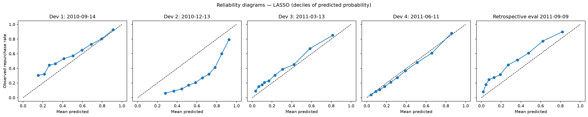

# Task 5 -- Predictive Statistical Modelling

*Owner: Member C. The formal model selection comes from `notebooks/python/03b_model_selection.ipynb` (sections D0–D8),
and its tables are exported to `reports/tables/task5_*.csv` and `.md`. Fitting details, assumption checks and diagnostics
come from the exploratory analysis in `notebooks/python/03_predictive_modelling.ipynb` (sections A1–C4).*

## 5.1 Three related prediction problems

| Problem | Target | Evaluated on | Candidates |
|---|---|---|---|
| 1. Repurchase probability | `Repurchase`: any purchase in the next 90 days | All eligible customers | Full logistic; forward, backward and best-subset selection (AIC); Ridge; LASSO; elastic net. Baselines: constant training rate, recency rank |
| 2. Conditional positive spend | `FutureSpend` among customers who buy | Repurchasers only | OLS on log(spend) with Duan smearing; Gamma GLM (log link); training mean (training median shown for illustration only) |
| 3. Unconditional expected spend | P(repurchase) × E[spend \| repurchase] | **All** eligible customers, including £0 spenders | Each spend model combined with the selected probability model; constant training mean as baseline |

These are different questions, so **no single "best model" is declared across them**.

**Features (9).** Recency, TenureDays, CancellationRate, log1p(Frequency), log1p(Monetary), log1p(DistinctProducts),
log1p(AvgBasketValue), IsUK and AcquiredInQ4. All are computed from purchases **before** the origin *t*. Both targets use
the **half-open window [t, t + 90 days)**. `CustomerID` and the targets are never predictors.

The probabilities are **predictions under the conditions observed historically**, including whatever marketing the
retailer was already doing. They are **not** identified "no-offer" probabilities. Historical data identify neither the
effect of a campaign nor what customers would have done without one. That requires the Task 6 experiment.

## 5.2 Validation design: why not just a random split

A random customer split, used in the exploratory notebook 03, tests whether the model predicts *other customers in the same
period*. The retailer will instead train on the past and score a *later* period. Model selection therefore uses
**rolling-origin development periods**. Origins are spaced exactly 90 days apart, so each training snapshot's labels are
complete by the next origin, when the model would be used:

| Role | Train on origin | Predict at origin | Eligible customers | Repurchase prevalence |
|---|---|---|---|---|
| Development period 1 | 16 Jun 2010 | 14 Sep 2010 | 3,364 | 57.5% |
| Development period 2 | 14 Sep 2010 | 13 Dec 2010 | 4,292 | 30.4% |
| Development period 3 | 13 Dec 2010 | 13 Mar 2011 | 4,581 | 35.3% |
| Development period 4 | 13 Mar 2011 | 11 Jun 2011 | 4,951 | 32.0% |
| **Retrospective temporal evaluation** | 11 Jun 2011 | 9 Sep 2011 | 5,253 | 43.4% |

* **Development only for selection.** All tuning, subset selection, scaling and smearing happen inside each training
  snapshot. For Ridge, LASSO and elastic net the scaler sits *inside* a `GridSearchCV` pipeline: the regularisation
  strength is chosen by 5-fold inner cross-validation on the **Brier score**, so no inner validation fold influences the
  scaling. Forward, backward and best-subset selection are re-run by AIC in every training snapshot.
* **The four development periods cover each season once**, which is why they are weighted equally.
* **Prior exposure, stated honestly.** The Sep–Dec 2011 outcomes were examined in earlier versions of this analysis, so
  they cannot be an untouched test set. The final evaluation is a **retrospective temporal evaluation** of a model locked on
  development data. The dataset contains no later, unexamined data.
* **Repeated customers.** The same customer appears in several snapshots with different, time-stamped features. For a
  model meant to score *returning* customers, that is intended and is not leakage. But the rows are not independent, so
  uncertainty that pools periods uses a bootstrap that resamples **customers**.

## 5.3 Metrics and the selection rule (declared before the results)

| Metric | Role | Better |
|---|---|---|
| **Brier score** | **Primary**: the probabilities feed the two-part expected-spend calculation | Lower |
| Log-loss | Secondary; penalises confident errors | Lower |
| ROC-AUC | Ranking across all thresholds | Higher |
| Average precision (AP) | Precision–recall summary; depends on prevalence | Higher |
| Calibration intercept / slope | Logistic regression of the outcome on the predicted log-odds, estimated jointly | ≈ 0 / ≈ 1 |
| Precision@10%, Lift@10% | Repurchase rate among the top ceil(0.10 n) scores (ties broken by CustomerID); lift = precision ÷ prevalence. 10% is an illustrative contact capacity, not a client budget | Higher |
| Predictors | Non-zero coefficients, excluding the intercept (|β| ≤ 10⁻⁶ counts as zero) | Fewer when comparable |

Brier and log-loss measure overall probabilistic accuracy, not calibration alone. Accuracy, F1, a 0.5 threshold and
scenario profit are not used for selection: there is no fixed classification decision, and profit depends on an
unmeasured uplift.

**Rule.**
1. Exclude any candidate with a non-converged fit or invalid predictions.
2. Select the candidate with the smallest unrounded mean development Brier (equal weight per period).
3. Break exact ties by fewer predictors, then lower log-loss, then a fixed candidate order.
4. Report clustered bootstrap uncertainty.
5. Lock the selected candidate, refit it on the final training snapshot, and report its evaluation without reselecting.

All seven candidates converged in every period; none was excluded.

## 5.4 Repurchase probability: development results (used for selection)

| Model | Predictors (mean) | Brier ↓ | ROC-AUC ↑ | AP ↑ | Cal. intercept / slope | Precision@10% ↑ | Lift@10% ↑ | Verdict (Brier difference vs LASSO, 95% CI) |
|---|---|---|---|---|---|---|---|---|
| **LASSO** | 7.2 | **0.2026** | 0.779 | 0.713 | −0.30 / 0.96 | 0.864 | 2.35 | **Selected under the Brier rule** |
| Ridge | 9 | 0.2027 | 0.778 | 0.713 | −0.31 / 0.96 | 0.864 | 2.35 | Indistinguishable: +0.00001 [−0.00014, +0.00016] |
| Elastic net | 7.5 | 0.2028 | 0.778 | 0.713 | −0.30 / 0.97 | 0.863 | 2.34 | Worse: +0.00014 [+0.00005, +0.00023] |
| Forward selection | 5.5 | 0.2030 | 0.779 | 0.713 | −0.30 / 0.95 | 0.862 | 2.34 | Worse: +0.00035 [+0.00009, +0.00061] |
| Backward selection / best subset | 5.5 | 0.2030 | 0.779 | 0.713 | −0.30 / 0.95 | 0.862 | 2.34 | Worse: +0.00037 [+0.00011, +0.00064] |
| Full logistic | 9 | 0.2032 | 0.778 | 0.712 | −0.31 / 0.92 | 0.864 | 2.35 | Worse: +0.00051 [+0.00024, +0.00079] |
| Constant (training rate) | — | 0.2471 | 0.500 | 0.388 | N/A | 0.414 | 1.08 | Baseline |
| Recency rank | — | N/A | 0.719 | 0.587 | N/A | 0.670 | 1.81 | Baseline |

*Development: equal-weight means over four rolling-origin periods. CIs come from 2,000 bootstrap replicates resampling
4,951 distinct customers across all periods.*

**Reading the table.** Every model is far better than the baselines. The differences *between* models are tiny: at most
0.0005 in Brier (about 0.25%), with identical AUC to two decimals. LASSO is the model **selected under the declared
rule**, not a clearly superior model, and Ridge is statistically indistinguishable from it. LASSO kept 7.2 of 9 predictors
on average. Recency, cancellation rate and log(Frequency) were selected in every fit with stable signs. Tenure,
log(Monetary), log(DistinctProducts) and Q4 acquisition changed sign across fits, because they are correlated (see 5.6).
Their individual coefficients should not be over-interpreted.

## 5.5 Retrospective temporal evaluation of the locked model

LASSO was refitted on the 11 Jun 2011 snapshot (C = 0.089, 5 predictors kept) and evaluated on the 9 Sep 2011 customers.

| Model | Role | Brier | Log-loss | ROC-AUC | AP | Cal. intercept / slope | Precision@10% | Lift@10% |
|---|---|---|---|---|---|---|---|---|
| **LASSO** | **Locked** | **0.2005** | 0.608 | 0.791 | 0.758 | +0.63 / 0.79 | 0.899 | 2.07 |
| Full logistic | Benchmark | 0.2014 | 0.612 | 0.789 | 0.756 | +0.60 / 0.76 | 0.895 | 2.06 |
| Constant (training rate) | Benchmark | 0.2584 | 0.712 | 0.500 | 0.434 | N/A | 0.462 | 1.07 |
| Recency rank | Benchmark | N/A | N/A | 0.762 | 0.681 | N/A | 0.768 | 1.77 |

*Prevalence 0.434; n = 5,253. Other candidates are reported in `reports/tables/task5_final_classification.md` for
description only. Nothing is reselected from them.*

**Paired bootstrap (2,000 replicates), locked LASSO minus benchmark:**
* vs full logistic: Brier −0.0009 [−0.0012, −0.0005]; AUC +0.002 [+0.001, +0.003].
* vs constant rate: Brier −0.058 [−0.064, −0.052].
* vs recency rank: AUC +0.030 [+0.023, +0.037]; Precision@10% +0.131 [+0.095, +0.169].

**Ranking holds up in the later period, but calibration does not.** The locked model predicts a mean of 0.30 against an
actual 0.43 (intercept +0.63, slope 0.79). Across the development periods the calibration intercept ranged from −1.76 to
+0.40: the probability *level* follows the training season. One recalibration policy was tested on development data only:
an intercept shift learned from the most recent completed period. It made the evaluation **worse** (Brier 0.2005 → 0.2063),
because the seasonal shift reversed. **No simple recalibration policy is supported by these data.**

*Figure 5.1: Reliability diagrams for the selected model in each development period and the retrospective evaluation.*

## 5.6 Assumptions and diagnostics (exploratory notebook 03)

* **Multicollinearity.** VIF: log1p(Monetary) 203, log1p(Frequency) 98, log1p(AvgBasketValue) 59 (all others < 3.1).
  Monetary = Frequency × AvgBasketValue, so the identity holds exactly on the log scale. For the **log1p** features used
  here it is not exact, but very close: a regression of log1p(Monetary) on the other two has R² = 0.994. In the unpenalised
  model this makes the coefficients of log1p(Frequency) and log1p(Monetary) unstable (odds ratios 3.48 [1.43, 8.48] and
  0.51 [0.15, 1.74]).
* **Ridge vs LASSO.** Ridge keeps all nine predictors and stabilises the correlated coefficients through **shrinkage**,
  which is what it was designed for (Hoerl & Kennard, 1970). LASSO additionally sets some coefficients to zero
  (Tibshirani, 1996). That sparsity is a separate interpretability advantage, not automatic superiority, and the two are
  statistically indistinguishable here (5.4).
* **Linearity of the logit.** Close to linear for frequency, monetary value and product breadth. Recency is mildly curved
  (Box–Tidwell p = 0.006), and tenure is U-shaped.
* **Influence.** No customer dominates the repurchase model (largest Cook's distance 0.008).
* **Class balance.** At 43/57 (and 30–58% across periods), no resampling is needed. Resampling would also distort the
  probabilities the expected-spend calculation relies on.

## 5.7 Spend: conditional and combined selection

**Conditional positive spend** (repurchasers; primary metric RMSE in £, because the quantity needed is a conditional mean):

| Model | Development RMSE | MAE | Median AE | Retrospective eval. RMSE (n = 2,278) | MAE | Median AE | Mean predicted vs observed |
|---|---|---|---|---|---|---|---|
| **Log-OLS + Duan smearing** | **2,062** | 636 | 296 | **3,358** | 657 | 222 | £808 vs £1,223 |
| Gamma GLM (log link) | 2,074 | 638 | 298 | 3,398 | 668 | 218 | £786 vs £1,223 |
| Training mean | 3,123 | 999 | 704 | 4,694 | 1,090 | 673 | £1,042 vs £1,223 |
| Training median (illustrative, targets the median) | 3,169 | 796 | 279 | 4,756 | 955 | 274 | £431 vs £1,223 |

**Unconditional expected spend** (all customers, with the LASSO probability fixed):

| System | Development RMSE | MAE | Retrospective eval. RMSE (n = 5,253) | MAE | Median AE | Mean predicted vs observed |
|---|---|---|---|---|---|---|
| **P × Log-OLS + Duan smearing** | **1,377** | 405 | **2,269** | 400 | 101 | £294 vs £530 |
| P × Gamma GLM | 1,386 | 404 | 2,297 | 406 | 104 | £287 vs £530 |
| P × training mean | 1,991 | 547 | 3,098 | 504 | 187 | £314 vs £530 |
| Constant training mean (baseline) | 2,039 | 611 | 3,154 | 613 | 334 | £334 vs £530 |

* **Log-OLS with Duan smearing is selected for both problems.** The Gamma GLM is the more natural model *in principle*
  for a positive outcome whose variance rises with the mean (Manning & Mullahy, 2001), and it is close behind, but the
  declared rule picks the lower RMSE.
* **The selected systems clearly beat their training-mean baselines in the later period.** Conditional RMSE is lower by
  £1,336 (95% CI £693–£1,952) and expected-spend RMSE by £885 (£464–£1,293). Both **under-predict the level** in the
  Q4 evaluation window, so the £ amounts are not calibrated across seasons.
* **Large spenders drive RMSE.** The top 1% of evaluation repurchasers account for 28.4% of their spend. One training
  customer (1 order, £14 of history, then £450 of spend) has Cook's distance 7.4 in the Gamma GLM. Removing the five most
  influential *training* customers lowers Gamma's evaluation RMSE from £3,398 to £3,279. All customers are kept in the
  primary comparison.

## 5.8 From prediction to decisions

A retention campaign creates value only through the **incremental** purchases it causes (Ascarza, 2018; Devriendt et al.,
2021). These models do not estimate that. The exploratory notebook therefore keeps three analyses apart:

1. **Value ranking:** who has the highest expected spend. This needs no assumption about offers.
2. **Retrospective validation (notebook 03, A5 and C2):** each ranking scored on the test customers' realised spend.
   That spend only exists after the window closes, so this validates the ranking. It is neither a deployable profit nor an
   upper bound, because it still rests on an assumed uplift. Contacting the top 10% by repurchase probability would have
   earned about £9.3k, and the top 10% by expected spend about £9.8k, against £6.5k for contacting everyone
   (assumptions: 30% margin, £10 offer, 10% uplift).
3. **Prospective decision rule (notebook 03, C3):** contact a customer if **uplift × margin × expected spend > offer
   cost**. The threshold comes from the economics, not from a 0.5 probability cut-off: with the placeholder values,
   expected 90-day spend must exceed £333. That selects 39.8% of test customers, for a model-predicted incremental profit
   of £13.2k, **conditional on the assumed uplift**. Across uplift × margin from 1% to 8% and offer costs of £5–£20, the
   contact share runs from **4% to 82%** and predicted profit from **£1.4k to £47k**. Because the spend *level* is
   under-predicted in a new season (5.7), these figures are scenarios, not forecasts.

## 5.9 Recommendation

* **Probability model: LASSO logistic regression**, selected under the pre-declared Brier rule and locked before the
  retrospective temporal evaluation. Ridge is an equally defensible alternative (statistically indistinguishable). The
  choice does not rest on AUC: all candidates tie to two decimals.
* **Use it to rank customers.** Ranking is supported in the development periods and in the later period. It beats the
  recency rule (AUC +0.030; precision in the top 10% +13 points) and the constant rate.
* **Do not treat its probabilities, or the spend predictions, as calibrated £ quantities across seasons.** Their level
  shifted in every period, and a simple recalibration made things worse. Any budget calculation needs a same-season or
  experimentally validated correction.
* **Spend: log-OLS with Duan smearing**, for both conditional and expected spend.

**Limitations.**
* The models predict repurchase, not response to an offer.
* The evaluation period was seen before, so the evaluation is retrospective, not blind.
* There are only four development periods and one evaluation period, from about two years of data.
* `Monetary` still counts orders that were later cancelled.
* Conclusions apply only to identifiable customers (Task 3).

## References (Task 5)

Full entries are in the Task 2 references (section 2.9): Ascarza (2018); Devriendt et al. (2021); Hoerl & Kennard (1970);
Manning & Mullahy (2001); Tibshirani (1996).
