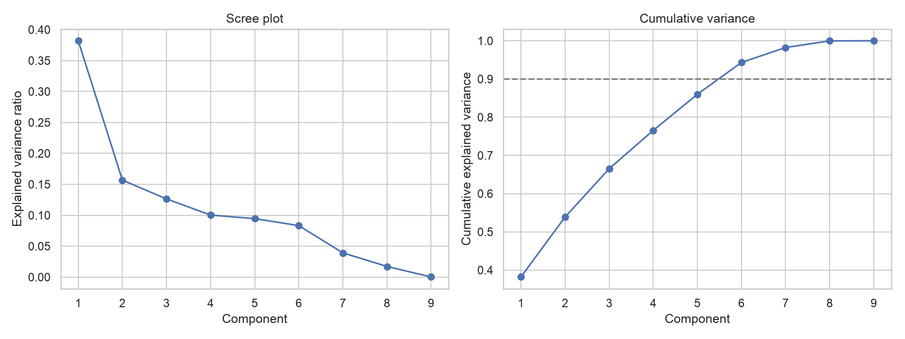

# Task 7 -- Critical Evaluation of Principal Component Analysis

*Owner: Member B. Results come from `notebooks/python/04_pca_evaluation.ipynb`.*

**What was actually run.** Two different methods are used, and they are named precisely:

* **Classical PCA** (`sklearn.decomposition.PCA`) on the 9-feature customer table. Each feature is **centred and scaled**
  (standardised) first, because the features are on very different scales (days, counts, £, rates).
* **Truncated SVD** (`TruncatedSVD`) on the 5,253 × 4,445 customer × product matrix. This is a **PCA-related** method, not
  PCA. It factorises the matrix **without centring** it. Centring would turn almost every zero in a 98.3%-sparse matrix
  into a non-zero value, making the matrix dense. The cost of not centring is that the components are not the directions of
  maximum variance around the mean, so the "variance retained" figure is not directly comparable to a PCA scree plot. The
  two methods give the same components only when every column already has mean zero.

## 7.1 Does the customer feature table need dimensionality reduction?

**No.** PCA needs **6 of the 9 components to retain 90% of the variance**, so there is almost no compression (Figure 7.1).
The real problem in this table is the collinearity of log(Monetary), log(Frequency) and log(AvgBasketValue) (VIF up to
203, Task 5), and LASSO and elastic net already resolve it by **dropping** the redundant feature. That keeps every
remaining coefficient as a named, business-readable odds ratio.

**Why PCA would harm interpretability here.** Each principal component is a weighted mix of all nine features. A
statement like "a 1 SD increase in PC2 raises the odds of repurchase by 30%" cannot be acted on by an account manager,
whereas "customers who have not ordered for longer are less likely to return" can. In regression, components with little
variance can still carry the most predictive signal, so dropping them to save dimensions can throw information away
(Jolliffe, 1982).

*Figure 7.1: PCA on the standardised customer table. Six of nine components are needed for 90% of the variance.*

## 7.2 Where reduction is useful: the sparse customer × product matrix

Here the dimensionality *is* the problem: 4,445 products, and 98.3% of customer–product cells empty. This is the
situation in which dimensionality reduction pays off (Jolliffe & Cadima, 2016).

**The input matters as much as the method.** The first version ran Truncated SVD on summed **quantities**. Twenty
components appeared to retain 86.7% of the variance, but the first component was **100% one customer** (a Danish
wholesaler's bulk orders) and the second was 92% another. The components described individual large accounts, not
shared buying patterns, because SVD without centring or scaling is dominated by the largest values.

The analysis therefore uses a **binary bought / not-bought matrix**. That asks which products are bought by the same
customers, and stops order size from dominating:

| | Raw quantities | Binary (used) |
|---|---|---|
| Share of SVD1 from the single largest customer | 100% | 2.7% |
| Share of SVD2 from the single largest customer | 91.6% | 0.8% |
| Variance retained by 20 components | 86.7% (misleading) | **19.4%** |

On the binary matrix the components are interpretable:

* **SVD1:** breadth of buying. Customer scores correlate 0.97 with the number of distinct products bought, which is largely
  the existing DistinctProducts feature.
* **SVD2:** home décor (wicker hearts, wooden frames) vs children's items (lunch bags and boxes, plasters in tins).
* **SVD3:** jumbo and lunch bags vs traditional games and crafts.
* **SVD4:** kitchen and tea-time (Regency teacups, cake stands) vs small novelty items.

The honest compression figure is that 20 components retain only **19.4%** of the variance. Buying across 4,445 products
does not reduce to a few dimensions. The components summarise the strongest themes, not the whole picture.

## 7.3 Impact on predictive modelling

**How it was evaluated.** On the same train/test split, the same unpenalised logistic model was fitted with and without
the 20 SVD components. The SVD was fitted on training customers only, to avoid leakage. The two AUCs were compared with a
paired bootstrap (2,000 resamples of the test customers).

**Result.** AUC rises from **0.8091 to 0.8147**: a difference of **+0.0057, 95% CI [+0.0002, +0.0111]**. The gain is only
just distinguishable from zero and small in practice. It costs 20 extra, hard-to-explain features, and it has been checked
on one split only, not with cross-validation or out of time as the main model was (Task 5). The product themes are more
valuable as **descriptive segmentation**, e.g. for product-specific retention offers, than as a predictive upgrade.

## 7.4 When PCA should and should not be used

| Use PCA / SVD when… | Avoid it when… |
|---|---|
| Dimensionality itself is the problem (thousands of sparse columns, as with products) | There are only a few features, each already meaningful (the 9-feature table) |
| The goal is to discover structure, e.g. co-purchase themes for segmentation | Coefficients must be explained to managers as odds ratios |
| Predictors are numerous and highly correlated and interpretation does not matter | Collinearity can be handled by penalised regression without losing feature identity |
| Inputs have been prepared so that no single extreme case dominates (binary, scaled or log-transformed) | Raw, heavy-tailed inputs would let a few outliers define the components, as happened with raw quantities here |

**Conclusion.** Dimensionality reduction is not beneficial for this project's customer-level model, but it is useful for
describing the product dimension, provided the matrix is prepared carefully. The most transferable lesson is how sensitive
it is to preprocessing: on raw quantities, the same algorithm produced components that looked meaningful but were driven
by single customers.

## References (Task 7)

Jolliffe, I. T. (1982). A note on the use of principal components in regression. *Journal of the Royal Statistical Society: Series C (Applied Statistics), 31*(3), 300--303. https://doi.org/10.2307/2348005

Jolliffe, I. T., & Cadima, J. (2016). Principal component analysis: A review and recent developments. *Philosophical Transactions of the Royal Society A, 374*(2065), 20150202. https://doi.org/10.1098/rsta.2015.0202
