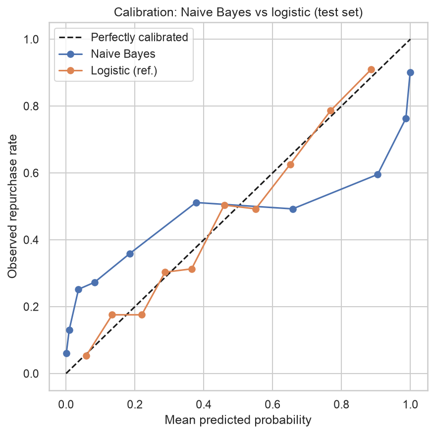
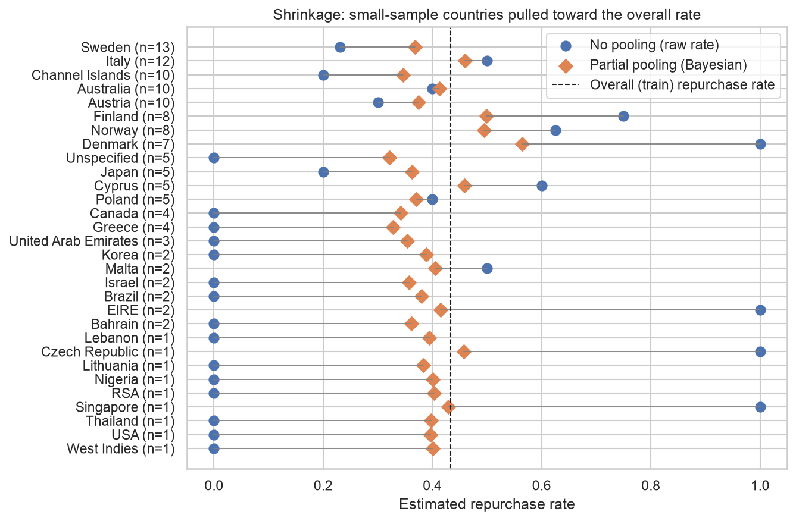

# Task 8 -- Critical Evaluation of Bayesian Statistical Methods

*Owner: Member C. Results come from `notebooks/python/05_bayesian_methods.ipynb`. The models use the same train/test
split and features as Task 5, so the results are directly comparable.*

## 8.1 Naive Bayes

Naive Bayes assumes the features are independent given the outcome. Here that assumption is clearly violated:
log(Monetary), log(Frequency) and log(AvgBasketValue) are almost an exact linear combination of one another (VIF up to
203, Task 5).

| Test set | AUC | Brier |
|---|---|---|
| Naive Bayes (Gaussian) | 0.801 | 0.212 |
| Logistic regression, same split (reference) | 0.810 | 0.175 |
| Constant base-rate prediction | — | 0.246 |

Naive Bayes ranks customers almost as well as logistic regression. It can classify well even when its independence
assumption fails (Domingos & Pazzani, 1997). But its **probabilities are badly calibrated**: by treating three correlated
features as independent evidence, it counts the same signal two or three times and pushes probabilities towards 0 and 1
(Niculescu-Mizil & Caruana, 2005; Figure 8.1). **Verdict:** acceptable as a quick ranking baseline, but its probabilities
must not feed a profit rule without recalibration.

*Figure 8.1: Calibration of Naive Bayes vs logistic regression (test set).*

## 8.2 Bayesian hierarchical regression: partial pooling across countries

**Why it is needed.** The customer base spans **41 countries; 26 have fewer than 10 customers and 13 have only 1 or 2.**
A separate repurchase rate per country would be meaningless for most of them: one customer makes the rate 0% or 100%.
Ignoring country throws away real differences. Partial pooling sits between the two. Each country gets its own baseline,
drawn from a shared distribution, so small countries are pulled ("shrunk") towards the overall rate while large countries
keep their own (Efron & Morris, 1975; Abe, 2009).

**Model.** logit P(repurchase) = a[country] + b_recency × Recency + b_freq × log(Frequency) (standardised), with
a[country] = mu_a + sigma_a × offset[country]. This is a non-centred parameterisation, which samples better.

**Priors, and why.**

* `mu_a ~ Normal(0, 1.5)`: the overall baseline log-odds. It puts most prior mass between about 5% and 95% repurchase, so
  nothing plausible is ruled out.
* `sigma_a ~ HalfNormal(1)`: how much countries differ. An SD of 1 on the log-odds scale already allows rates from roughly
  20% to 70%, so this says "differences of that size are plausible, much larger ones are unlikely". A weakly informative
  prior on a between-group SD is the recommended choice when there are few groups or little data per group (Gelman, 2006).
* `b ~ Normal(0, 1)`: weakly informative. With about 3,900 customers the data dominate: the posterior SD is about 0.05.

**Convergence.** The first run (`target_accept` 0.9) produced **26 divergences**. These came from the funnel-shaped
posterior near sigma_a = 0, which is plausible here because the data cannot rule out countries barely differing. The final
run uses `target_accept` 0.99 with 2,000 tuning and 2,000 sampling iterations in each of 4 chains: **0 divergences out of
8,000 draws, maximum R-hat 1.004, and bulk ESS ≥ 1,309** (for sigma_a, the hardest parameter). The posterior means barely
changed between the two runs.

**Posterior results and uncertainty.**

* Recency: −0.75; log(Frequency): +0.70 (posterior means on the log-odds scale). The signs agree with Task 5.
* **sigma_a: mean 0.46, 89% interval [0.06, 0.99].** The data cannot tell whether countries barely differ or differ
  substantially. That is an honest reflection of how little information most countries carry.
* **Shrinkage:** Denmark (n = 7) moves from a raw 100% repurchase rate to 56.5%; Cyprus (n = 5) from 60% to 45.9%;
  one-customer countries move to about 38–46%. Larger countries are shrunk less but still move: France (n = 59) goes from
  57.6% to 47.9%, because 59 customers is few next to the UK's 3,593 (Figure 8.2).

*Figure 8.2: Raw (no-pooling) vs partially pooled repurchase rates for countries with fewer than 15 customers.*

**Prior sensitivity.** The model was refitted with a tighter and a wider prior on sigma_a, using identical sampler settings:

| Prior on sigma_a | sigma_a mean [5%, 95%] | Divergences | Denmark | France | USA (n = 1) |
|---|---|---|---|---|---|
| HalfNormal(0.5) | 0.36 [0.04, 0.79] | 0 | 52.5% | 47.1% | 40.6% |
| **HalfNormal(1) (main)** | 0.46 [0.05, 1.00] | 0 | 56.5% | 47.9% | 39.6% |
| HalfNormal(2.5) | 0.52 [0.06, 1.11] | 1 | 58.3% | 48.2% | 38.5% |

The country estimates are **robust** to the prior choice, moving by a few points at most. The between-country spread
itself is prior-sensitive, as expected given how little data inform it.

**Predictive calibration (test set).** Probabilities are averaged over all 8,000 posterior draws. The 3 test customers from
countries never seen in training get a new country baseline drawn from the fitted distribution, something a no-pooling
model cannot do at all.

| Test set | AUC | Brier | Mean predicted (actual 0.434) |
|---|---|---|---|
| Hierarchical Bayes (2 predictors + country) | 0.798 | 0.181 | 0.441 |
| Logistic, 9 features (reference) | 0.810 | 0.175 | 0.438 |

The hierarchical model is well calibrated. It ranks slightly worse only because it uses two predictors rather than nine.

**Limits of the country estimates.** For the 26 countries with fewer than 10 customers, the estimate is mostly the pooled
average plus a small nudge from their own data. That is the correct behaviour, but it means the model **cannot reveal**
that a small market is genuinely different. It can only stop small samples from producing extreme estimates. The estimates
apply to identifiable customers only (Task 3), and the model includes only two behavioural predictors.

## 8.3 Bayesian decision making

**Corrected rule.** An earlier version computed "expected value" from each test customer's **realised** future spend, which
is unknown when the decision is made, and multiplied the offer cost by the repurchase probability. As a result the
probability had no effect on the decision. The rule now uses only information available at the cutoff:

> contact if the posterior expectation of **uplift × margin × P(repurchase) × E[spend | repurchase] − offer cost** is > 0,

with P(repurchase) taken from all 8,000 posterior draws and E[spend | repurchase] from OLS on log(spend) with Duan smearing,
the conditional-spend model selected in Task 5 (a frequentist plug-in, stated as such).

* **Prospective result (placeholder assumptions: 30% margin, £10 offer, 10% uplift).** The rule contacts customers with
  expected 90-day spend above £333: **38.5% of test customers** (506 of 1,314), for a model-predicted incremental profit of
  **£12.6k (90% posterior interval £12.2k–£13.0k)**. The interval covers uncertainty in the repurchase probabilities only;
  it does not cover the spend prediction or the assumed uplift. For 18 of the contacted customers, the posterior
  probability that contacting them pays off is below 90%.
* **Retrospective check (not deployable).** On realised spend, the same list would have earned £11.8k, against £6.5k for
  contacting everyone. This validates the ranking, not the profit level.
* **The unknown that matters is the uplift.** Uplift and margin enter only as a product. Across plausible values the contact
  share runs from 4% to 84%, and predicted profit from £1.3k to £50k. P(repurchase) is a prediction under historical
  conditions, not a no-offer counterfactual. The offer's causal effect needs a randomised experiment (Task 6).

## 8.4 Evaluation

| | Assessment |
|---|---|
| **Are Bayesian approaches appropriate?** | Yes, for two specific jobs: estimating rates for thin groups (countries, new accounts), and making decisions that carry their uncertainty through. Not as a replacement for the Task 5 model on the bulk of the customer base |
| **Advantages** | Principled shrinkage for small groups; a full posterior for every quantity, so decisions can use "probability that this pays off" rather than a point estimate; a prediction for an unseen country; priors that make assumptions explicit and testable |
| **Limitations** | Priors can be contested (here the country estimates were checked and found robust, but sigma_a is not); MCMC is computationally heavy (about a minute per fit here) and needed tuning to converge; it is harder to explain to non-technical managers than an odds ratio; Naive Bayes's independence assumption is clearly violated |
| **When Bayesian methods outperform traditional ones** | Many small groups (26 countries with fewer than 10 customers); decisions where uncertainty matters (contact only if the probability of profit is high); entering a new market with no history; combining prior knowledge, such as an expert's estimate of the offer effect, with data |

**Recommendation.** Keep the Task 5 LASSO model (selected under the Brier rule) for ranking the main (UK-dominated) customer base. Use the
hierarchical model's pooled estimates for thin or new international markets. Use the Bayesian decision framework only once
the uplift has been measured.

## References (Task 8)

Full entries are in the Task 2 references (section 2.9): Abe (2009); Domingos & Pazzani (1997); Efron & Morris (1975);
Gelman (2006); Niculescu-Mizil & Caruana (2005).
