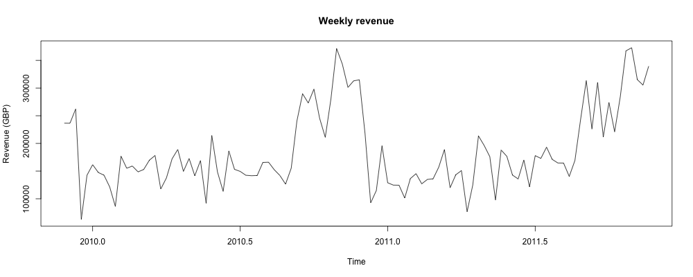
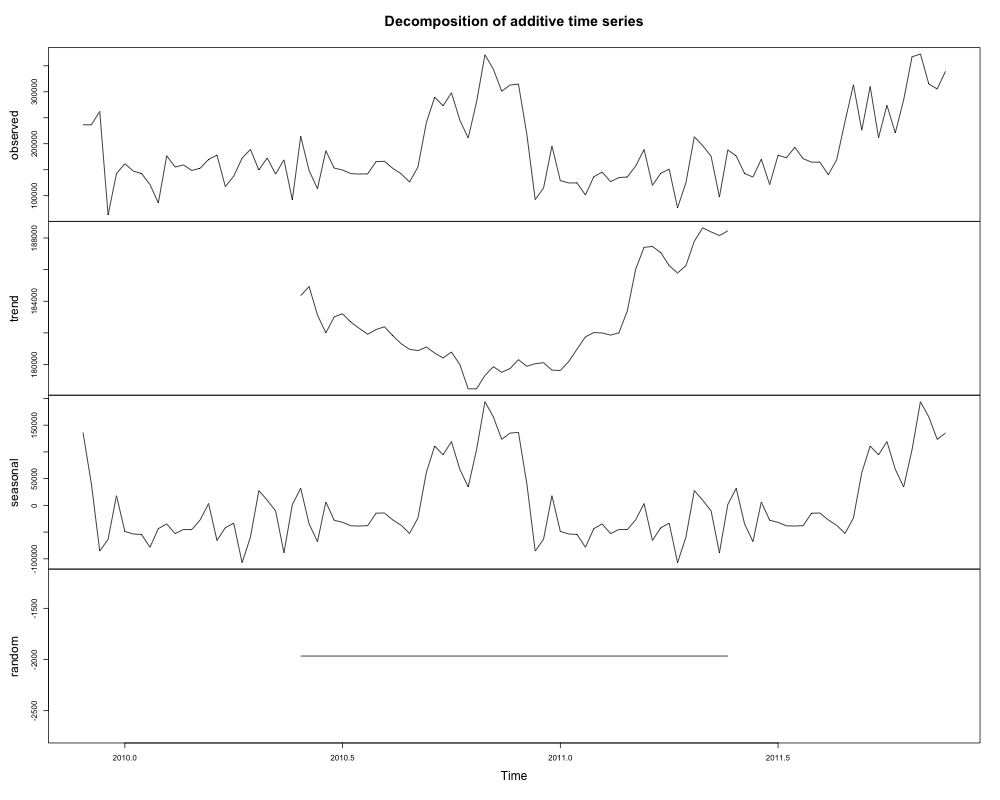
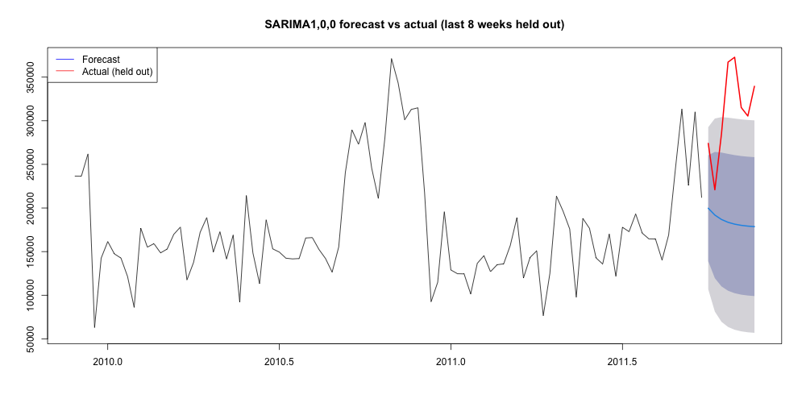

# Task 9 -- Time Series Analysis

*Owner: Member D. The brief does not require time-series analysis, only a critical discussion. This project goes further
and runs the diagnostics, because they turn the discussion's main caveat (too little history) into evidence. Results come
from `notebooks/r/06_time_series.R` (weekly revenue, 104 weeks, November 2009 – December 2011).*

> **Status: exploratory only.** The fitted model performed **worse** than a naive benchmark. Nothing in this section
> supports deploying a forecasting model yet.

## 9.1 Trend analysis

Weekly revenue was aggregated from the cleaned invoice lines. Outside the fourth quarter, the two years look similar.
Revenue rises from August/September, peaks in November (£1.43M in November 2010, £1.45M in November 2011, about 2.2 times
a typical off-peak month), and falls sharply in December. The business effectively pauses over Christmas and New Year:
revenue is £0 in the weeks ending 3 January 2010 and 2 January 2011, which is a structural break any model has to handle.
Stationarity tests **disagree**: ADF (p = 0.61) cannot reject a unit root, while KPSS (p = 0.091) does not reject
stationarity at the 5% level. `ndiffs()` suggests one order of differencing. The series sits in an unclear zone between
trending and stationary.

*Figure 9.1: Weekly revenue, November 2009 – December 2011.*

## 9.2 Seasonal analysis

* **Weekly pattern:** Saturday revenue is essentially zero (£9,803 in total, against £2.96M–£4.01M for each weekday) and
  Sunday is well below weekday levels. This is a B2B trading rhythm.
* **Annual pattern:** the data contain **only about two annual seasonal cycles**. Classical decomposition reports seasonal
  and trend strength of essentially 1.0, but that is an artefact, not evidence of strong seasonality. With a 52-week period,
  each week-of-year's seasonal value is estimated from at most **two** observations, so the decomposition fits almost
  perfectly by construction. **The seasonal strength estimates are unstable and should not be read at face value.**

*Figure 9.2: Classical decomposition of weekly revenue. The near-perfect seasonal fit reflects only two cycles of data.*

## 9.3 Forecasting and ARIMA modelling

The last 8 weeks were held out as a test period, and `auto.arima()` (Hyndman & Khandakar, 2008) was fitted on the
remaining 96 weeks.

* It selected a plain, **non-seasonal ARIMA(1,0,0)**. It could not attempt a seasonal (SARIMA) model, because 96 weeks is
  less than two full 52-week cycles.
* Its residuals show no remaining autocorrelation (Ljung–Box p = 0.69), so the model is not mis-specified for the little
  structure it can capture.
* **Benchmark comparison.** On the 8 held-out weeks, the model's RMSE was **£135,207**. Simply repeating the last observed
  week (a naive forecast) gave **£109,032**. **The fitted model performed worse than the naive benchmark.**

This agrees with forecasting research: simple benchmarks are hard to beat, and any model has to be compared against them
before use (Fildes et al., 2022; Makridakis et al., 2022). Three independent symptoms point to the same root cause: the
suspiciously perfect decomposition, the conflicting stationarity tests, and auto.arima's inability to fit a seasonal term.
That root cause is **too little history**.

*Figure 9.3: ARIMA forecast for the 8 held-out weeks against actual revenue.*

## 9.4 How time series analysis should be incorporated

With **at least three to four years** of weekly data, a seasonal model (SARIMA, or exponential smoothing with a seasonal
term) could be estimated properly and validated over a full held-out season. Until then:

* Plan Q4 from the **calendar and last year's pattern plus a buffer**, not from a fitted model (Task 12, O3 and R4).
* Keep the **naive and seasonal-naive forecasts** as the benchmark any future model must beat.
* Handle the Christmas shutdown weeks explicitly as a structural break.

## 9.5 Business applications and expected benefits

| Application | How it would be used | Expected benefit (once enough history exists) |
|---|---|---|
| Inventory planning | Forecast the Q4 build-up, which starts in August/September | Less stock-out risk at the peak, less over-stock afterwards |
| Staffing and dispatch | Weekday rhythm, no Saturday trading, 10:00–16:00 order peak | Capacity matched to demand |
| Campaign timing | Retention campaigns (Task 10) timed before the peak and the Christmas shutdown | Offers land when customers are planning orders |
| Cash-flow planning | Expected revenue path through the year | Earlier view of working-capital needs ahead of Q4 |

The descriptive pattern is already actionable for planning. A forecasting **model** is not yet justified.

## References (Task 9)

Fildes, R., Ma, S., & Kolassa, S. (2022). Retail forecasting: Research and practice. *International Journal of Forecasting, 38*(4), 1283--1318. https://doi.org/10.1016/j.ijforecast.2019.06.004

Hyndman, R. J., & Khandakar, Y. (2008). Automatic time series forecasting: The forecast package for R. *Journal of Statistical Software, 27*(3), 1--22. https://doi.org/10.18637/jss.v027.i03

Makridakis, S., Spiliotis, E., & Assimakopoulos, V. (2022). M5 accuracy competition: Results, findings, and conclusions. *International Journal of Forecasting, 38*(4), 1346--1364. https://doi.org/10.1016/j.ijforecast.2021.11.013
